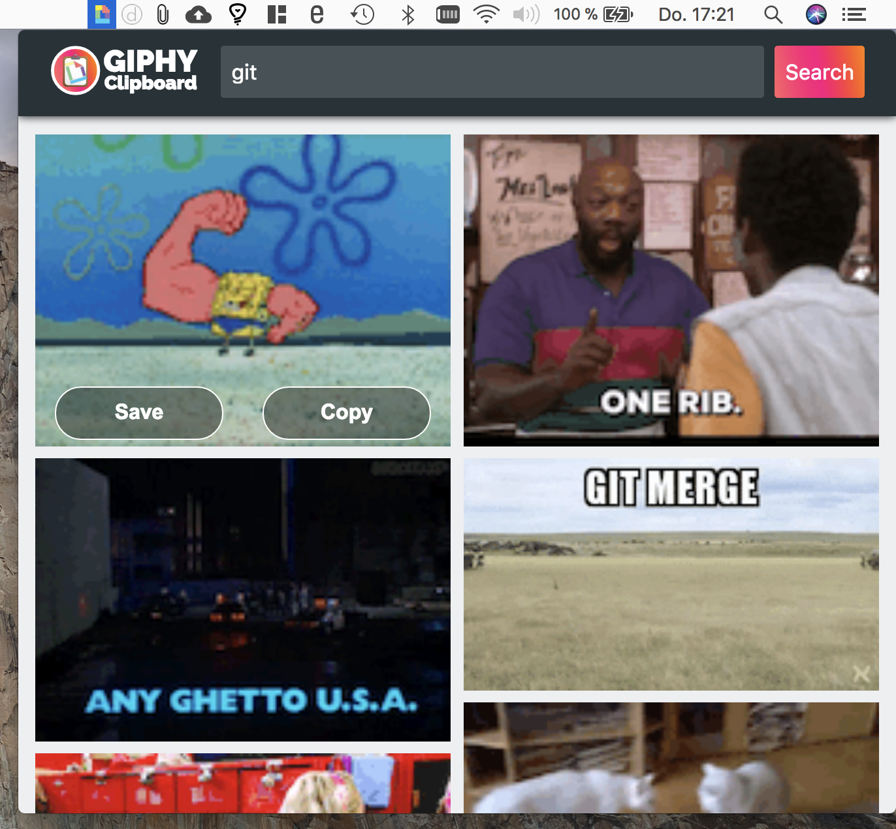
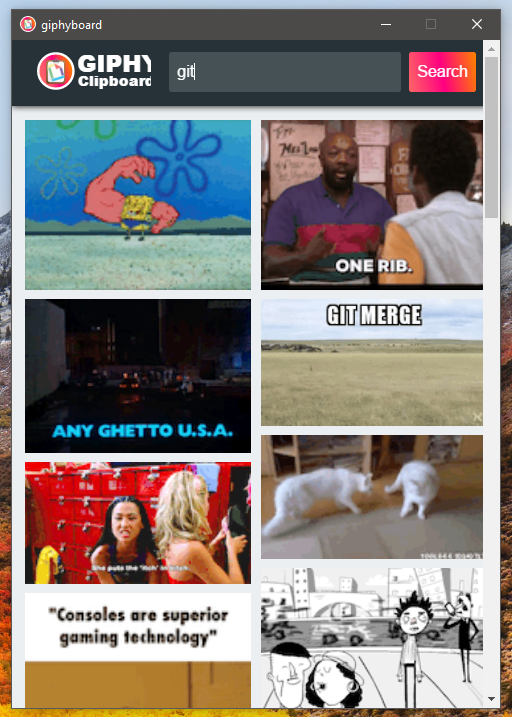
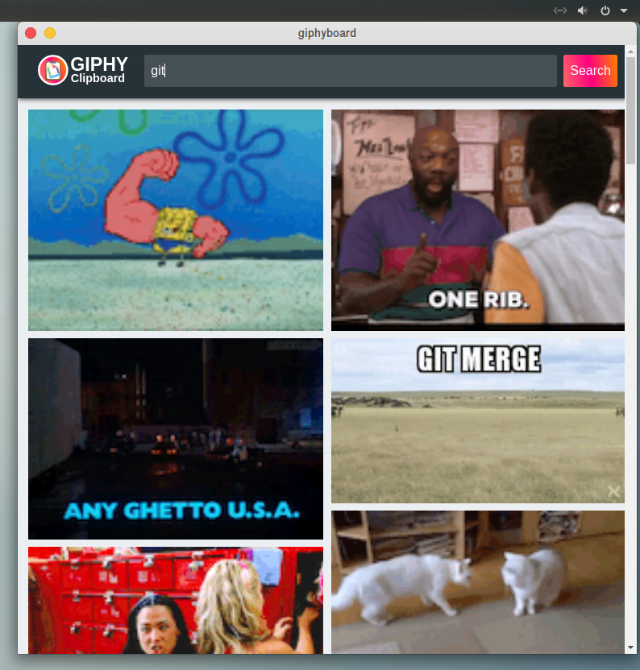

# GIPHY-Clipboard

GIPHY-Clipboard is a small application based on the GIPHY-API, JavaScript and the Electron-Framework.
GIPHY-Clipboard is capable to run on Windows, macOS and Linux. When started, the app is accessible from the tool-bar of your operating-system. You can search for a GIF that is fitting a specific topic and copy its URL or save it in your local file-system.

  
  
 Screenshot GIPHY-Clipboard on macOS toolbar 

  
  
 Screenshot GIPHY-Clipboard on Windows 

  
  
 Screenshot GIPHY-Clipboard on Ubuntu 

